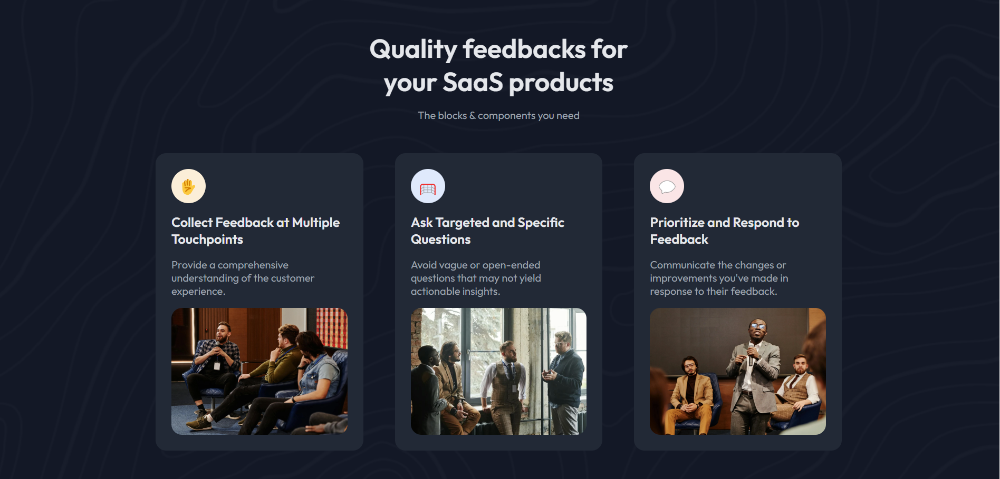

# Simple Feature Section

Este proyecto es una página web diseñada para mostrar una sección de características de un producto SaaS, enfocada en la recolección de feedbacks. Presenta un diseño moderno y adaptable a diferentes tamaños de pantalla.

## Vista Previa



Puedes ver la versión demo en vivo aquí: [Simple Feature Section](https://ibrahim-003.github.io/Simple-Feature-Section/)

## Características

- **Responsiva:** La página se adapta a diferentes tamaños de pantalla utilizando etiquetas `<picture>` y `srcset` para cargar imágenes adecuadas según el tamaño del dispositivo.
- **Diseño estructurado:** Cada característica se presenta en una tarjeta independiente, organizada con grid.
- **Contenido semántico:** Utiliza etiquetas semánticas como `<article>`, `<header>`, y `<section>` para mejorar la accesibilidad y el SEO.
- **Estilo moderno:** Usa la fuente "Outfit" desde Google Fonts para un estilo limpio y profesional.

## Estructura de Archivos

```
|-- index.html              # Página principal
|-- assets/
    |-- css/
    |   |-- reset.css       # Reseteo de estilos predeterminados del navegador
    |   |-- styles.css      # Estilos personalizados de la página
    |-- images/
    |   |-- photo_1.png     # Imagen para la primera característica
    |   |-- photo_1@2x.png  # Imagen en alta resolución para la primera característica
    |   |-- photo_2.png     # Imagen para la segunda característica
    |   |-- photo_2@2x.png  # Imagen en alta resolución para la segunda característica
    |   |-- photo_3.png     # Imagen para la tercera característica
    |   |-- photo_3@2x.png  # Imagen en alta resolución para la tercera característica
    |   |-- devchallenges-logo.svg # Favicon de la página
```

## Instalación

1. Clona este repositorio en tu máquina local:
   ```bash
   git clone https://github.com/Ibrahim-003/Simple-Feature-Section.git
   ```
2. Asegúrate de tener conexión a Internet para cargar las fuentes de Google Fonts y los estilos CSS.
3. Abre `index.html` en tu navegador para ver la página.

## Uso

Puedes personalizar esta página modificando los estilos en el archivo `styles.css` o ajustando el contenido en `index.html`. Cambia las imágenes, ajusta los títulos o añade más características según sea necesario.

## Tecnologías Utilizadas

- HTML5
- CSS3
- Google Fonts

## Autor

Este proyecto fue creado por [Ibrahim Almeyda].
